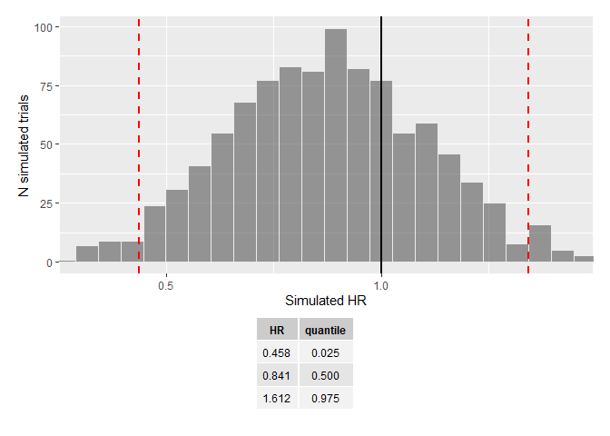

<!-- README.md is generated from README.Rmd. Please edit that file -->

# survTrial

The goal of survTrial is to document simulation methods used within
Bayer Medical Statistics Oncology. The current version of the package
runs simulation scenarios for PFS, allowing for either:

-   event times (progression and death) simulated from exponential
    distribution.
-   death times simulated from exponential distribution, but progression
    times are moved forward to next  
    scheduled time and censored times are moved back to previous visit
    after random generation from  
    exponential.

Summary statistics for Kaplan-Meier medians and associated simulation
graphs can be displayed for two treatment groups. Similarly, simulation
results for hazard ratio over all iterations of the trial design can be
extracted.

## Installation

You can install the latest version of survTrial from
[GitHub](https://github.com/) with:

``` r
# install.packages("devtools")
devtools::install_github("reevesj53/survTrial")
```

## Example

The code below shows examples of output from the simulations.

First, generate an example enrollment schedule in `enrol`, with ramp-up
period of 5 months, 10 subjects per month thereafter leading to a total
of 60 subjects with 1:1 randomization.

The visit schedule for tumor assessments is every 4 weeks (in
`schedule`). Median PFS for the two treatment groups (Sip-T and Placebo)
are 12 and 10 months respectively.

Data cut-off will occur at the 40th event.

``` r
library(survTrial)

enrol <- c(seq(2,10,length.out=5),rep(10,times=3))
schedule <- seq(0,100,4)
rxrate <- c(12,10)
nevent <- 40
```

The proportion of events that are deaths is set at 10% and censoring
rate is 10%. We accept the default method of moving progression events
forward to the next scheduled visit. Then run the simulation:

``` r
sim <- trial_sim(schedule, enrol, rxrate, nevent, adjust=TRUE, trt=c("Sip-T","placebo"),death.prop=0.1,
censor.prop=0.1,n.rep=1000)
```

The function `sim.km()` extracts both the simulated values for KM median
by iteration and treatment group, and associated summary statistics by
treatment group. This information is shown below.

``` r
sim.km <- calc_km(sim)
sim.km
#> $sim.km
#> # A tibble: 2,000 x 3
#>      rep rx      median
#>    <int> <chr>    <dbl>
#>  1     1 placebo     56
#>  2     1 Sip-T       68
#>  3     2 placebo     44
#>  4     2 Sip-T       52
#>  5     3 placebo     40
#>  6     3 Sip-T       56
#>  7     4 placebo     44
#>  8     4 Sip-T       48
#>  9     5 placebo     24
#> 10     5 Sip-T       56
#> # ... with 1,990 more rows
#> 
#> $median.quantile
#> # A tibble: 6 x 4
#>   rx      description KM_median quantile
#>   <chr>   <chr>           <dbl>    <dbl>
#> 1 placebo sim_low            24   0.0250
#> 2 placebo sim_median         44   0.5   
#> 3 placebo sim_high           72   0.975 
#> 4 Sip-T   sim_low            32   0.0250
#> 5 Sip-T   sim_median         52   0.5   
#> 6 Sip-T   sim_high           84   0.975 
#> 
#> attr(,"class")
#> [1] "trialsim.km"
```

A histogram plot of the simulated values for KM median can be obtained
by calling `plot_sim()` for `sim.km` object.

``` r
plot_sim(sim.km)
```

 Additional
options are available:

-   add confidence bounds as specified in `calc_km()` (defaults to 95%)
    to the plot.
-   add a table of summary statistics by treatment group.

``` r
plot_sim(sim.km, ci=TRUE, summary=TRUE)
```

 Simulation
results are also available for Hazard Ratio for each simulated trial by
running the code below.

``` r
sim.hr <- calc_hr(sim)
```

And a similar graph of the simulation results for Hazard Ratio with
associated summary table is obtained from the generic plotting function
`plot_sim()`, as shown in the following:

``` r
plot_sim(sim.hr, ci=TRUE, summary=TRUE)
```


