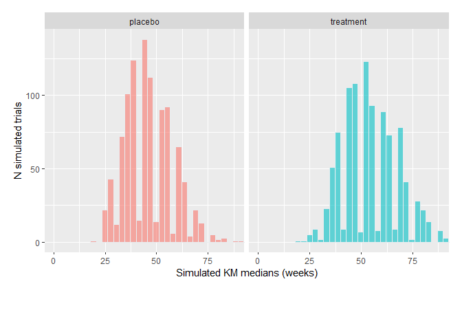
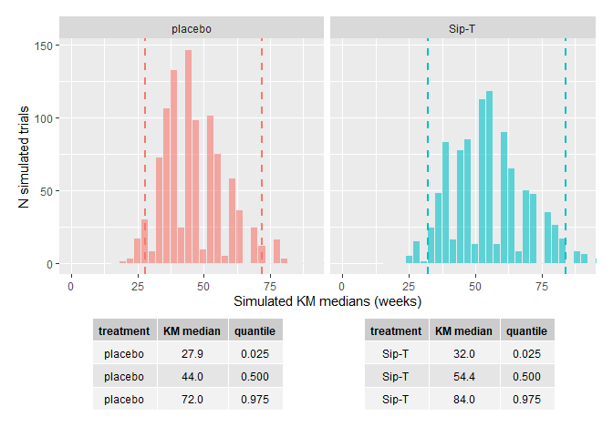

<!-- README.md is generated from README.Rmd. Please edit that file -->

# survTrial

The goal of survTrial is to document simulation methods used within
Bayer Medical Statistics Oncology. The current version of the package
runs simulation scenarios for PFS, allowing for either:

-   event times (progression and death) simulated from exponential
    distribution.
-   death times simulated from exponential distribution, but progression
    times are moved forward to next  
    scheduled time and censored times are moved back to previous visit
    after random generation from  
    exponential. Summary statistics for Kaplan-Meier medians and
    associated simulation graphs can be displayed for two treatment
    groups. Similarly, simulation results for hazard ratio over all
    iterations of the trial design can be extracted.

## Installation

You can install the latest version of survTrial from
[GitHub](https://github.com/) with:

``` r
# install.packages("devtools")
devtools::install_github("reevesj53/survTrial")
```

## Example

This is a basic example which shows you how to solve a common problem:

First, run survreg to fit parametric survival model:

    #> i Loading survTrial

Next, run simulation:

``` r
enrol <- c(seq(2,10,length.out=5),rep(10,times=3))
schedule <- seq(0,100,4)
rxrate <- c(12,10)
nevent <- 40
sim <- trial_sim(schedule, enrol, rxrate, nevent, adjust=TRUE, trt=c("Sip-T","placebo"),death.prop=0.1,
censor.prop=0.1,n.rep=1000)
```

Calculate survival curves with prediction intervals:

``` r
sim.km <- calc_km(sim)
sim.km
#> $sim.km
#> # A tibble: 2,000 x 3
#>      rep rx      median
#>    <int> <chr>    <dbl>
#>  1     1 placebo   28.8
#>  2     1 Sip-T     80  
#>  3     2 placebo   48.4
#>  4     2 Sip-T     44  
#>  5     3 placebo   64  
#>  6     3 Sip-T     68  
#>  7     4 placebo   48  
#>  8     4 Sip-T     80  
#>  9     5 placebo   52  
#> 10     5 Sip-T     52  
#> # ... with 1,990 more rows
#> 
#> $median.quantile
#> # A tibble: 6 x 4
#>   rx      description KM_median quantile
#>   <chr>   <chr>           <dbl>    <dbl>
#> 1 placebo sim_low          28     0.0250
#> 2 placebo sim_median       44     0.5   
#> 3 placebo sim_high         72     0.975 
#> 4 Sip-T   sim_low          32     0.0250
#> 5 Sip-T   sim_median       52     0.5   
#> 6 Sip-T   sim_high         86.5   0.975 
#> 
#> attr(,"class")
#> [1] "trialsim.km"
```

Next plot results

``` r
plot_sim(sim.km)
```

 Or add
confidence bounds and summary table to plot.

``` r
plot_sim(sim.km, ci=TRUE, summary=TRUE)
```


